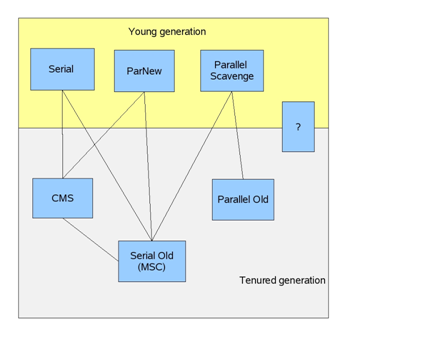
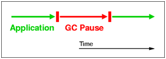
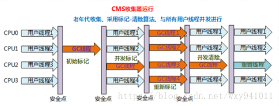

# 相关收集算法

## 通过GCRoot寻找存活的对象
+ 标记清除  先标记存活的对象,然后再清理其他内存区域,容易造成内存碎片
+ 复制算法  内存区域分为两份,将存活的对象移动到右侧,清理左侧,逻辑上左右侧身份互换,然後清理因为分成了两份可用内存大大减少
+ 标记整理  先标记存活对象,然后将存活对象移动到低地址的空间,内存空间不浪费,并且不产生内存碎片,但是效率相对来说要低,因为他不仅需要标记还需要移动对象
+ 标记整理算法和复制算法的疑惑?
    + 我的理解是通过GCRoot找到存活对象然后直接移动到低地址的一端,然后再清除其他内存区域
    + 复制算法和标记整理算法堆不需要扫描全堆
    + 标记整理算法需要标记吗?直接GCROOT扫描到直接移动,是这样吗?
    + 既然这样那为什么标记整理算法会比复制算法慢呢?
+ 相关的步骤
    + 大致想一下垃圾收集器需要进行那些步骤
        + 复制对象到某个地方
        + 将一个对象从原始位置移动到B,怎么确定位置B不存在对象呢?
        + 由于对象的内存地址变了,所以同时需要修改每个对象的引用地址
        + 也就是既需要移动对象同时又要保证对象间的相互引用正确
        + 即对象的拷贝和指针的修正
+ 复制算法不需要遍历全堆,标记整理算法需要遍历全堆
    + 标记整理算法不可以直接找到然后直接移动到另一侧吗?
#相关垃圾收集器

* Serial收集器
    * 串行收集,进行收集时会造成STW,采用标记整理算法  
    
* ParNew收集器
    * Serial收集器的多线程版本
* ParallelScavenge收集器
    * Serial收集器的多线程版本,和ParNew不同的是该收集器能和CMS一起使用
* Parallel Old收集器
    * 老年代的并行多线程串行收集器
* SerialOld收集器,老年代的串行单线程收集器
* CMS收集器
    * 和用户线程一起工作
    
# 直接可选的垃圾收集器方案
**通过排列以上垃圾收集器常用的不同的组合**
* -XX:+UseSerialGC
相当于”Serial” + “SerialOld”
* -XX:+UseParallelGC
相当于” Parallel Scavenge” + “SerialOld”
* -XX:+UseParallelOldGC
相当于” Parallel Scavenge” + “ParallelOld”，都是多线程并行处理；
* -XX:+UseConcMarkSweepGC,相当于"ParNew" + "CMS" + "Serial Old",CMS可能会Concurrent Mode Failure,失败采用SerialOld
# 碰到的问题
## 异常:GC overhead limit exceeded
	垃圾收集频繁发生,但是回收的对象却很少,GC效率不高,避免陷入恶性循环
	快速失败
>Exception in thread thread_name: java.lang.OutOfMemoryError: GC Overhead limit exceeded Cause: The detail message "GC overhead limit exceeded" indicates that the garbage collector is running all the time and Java program is making very slow progress. After a garbage collection, if the Java process is spending more than approximately 98% of its time doing garbage collection and if it is recovering less than 2% of the heap and has been doing so far the last 5 (compile time constant) consecutive garbage collections, then a java.lang.OutOfMemoryError is thrown. This exception is typically thrown because the amount of live data barely fits into the Java heap having little free space for new allocations.
Action: Increase the heap size. The java.lang.OutOfMemoryError exception for GC Overhead limit exceeded can be turned off with the command line flag -XX:-UseGCOverheadLimit.

    花费了98%的时间进行垃圾回收并且只回收了不到2%的空间,最少进行了5此连续的垃圾回收

