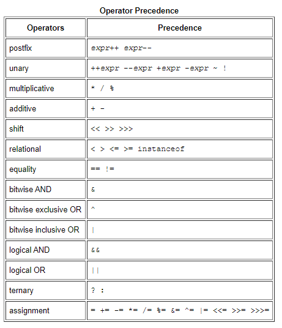

Random.nextInt(20) 生成0-19的随机数([0,19]不包括20)

##Java中的操作符优先级,越顶端的优先级越高



Java的每个方法有张异常表,异常造成的性能消耗很小

java中的int转byte是直接取int值的最后八位,不带符号位
int 129= 00000000 00000000 00000000 10000001
int x=(byte)(129)= (10000001 减一 10000000 取反 01111111 )等于-127
那byte自动补位成为int类型呢?
这个是按byte值的符号位扩展的
这样能保证十进制时运算时正确的
但是有时我并不需要十进制的值
可以通过0xff保持高位的值为0,低位的值不变,保证了二进制转换的一致性

# 自动类型转换
    所有长度低于int的类型在运算结束后结果会被提升为int类型
    当编译器明确知道整数的运算结果没有到达int的表示范围时，byte、short或char类型的运算结果不会被自动提升为int类型
    byte b=127;
    byte c=126+1;
    byte d=b+c;//报错

int x=129&0xff 其中的0xff是char类型
# 用DataOutputStream写数据到文件乱码?
    文本文件中显示的时ASCII值,而我们向文件中写入的是二进制值
    3的二进制是00000000 00000000 00000000 00000011
    如果将每个byte翻译成ASCII码就会乱码了

String s=s+x 会被替换成 s = (new StringBuilder()).append(s).append(k).toString();这种形式

# getDeclaredFields()和getFields()
    前者获取本类的所有字段
    (包括private,protected,public)
    后者获取本类以及父类的所有public字段

# File类的separator,separatorChar,pathSeparator,pathSeparatorChar
    separator是单个路径中不同父子目录中的分隔符,linux is '/' and windows is '\'
    pathSeparator是多个路径之间的分隔符,linux is ':' and windows is ';'
    至于后面的Char表示的是字符型,没有Char的是字符串型

# 多个流的关闭顺序
    Closing the wrapper stream automatically closes the inner stream.
        1--直接关闭最外面的流,他会自动关闭其他包装的流
        2--从外层开始关,一直到最内层


# 四个基本的注解
    @Target     标注该注解能注解在哪里(类上,方法上,字段上,方法参数上)
    @Retention  标注注解的生命周期(源码,编译时,运行时)
    @Document   标注注解是否能文档化
    @Inherited  标注注解是否能被继承
    
    NOTE:
        注解时被动的元数据,永远不会产生主动的行为,
        也就是我们必须在某个地方写如何处理注解
    注解的处理:
    运行时处理
    编译时处理


生成的动态链接库文件名称前缀必须是”lib“，不然JNI无法解决
# Hotspot源码目录结构
    ├─agent                            Serviceability Agent的客户端实现
    ├─make                             用来build出HotSpot的各种配置文件
    ├─src                              HotSpot VM的源代码
    │  ├─cpu                            CPU相关代码（汇编器、模板解释器、ad文件、部分runtime函数在这里实现）
    │  ├─os                             操作系相关代码
    │  ├─os_cpu                         操作系统+CPU的组合相关的代码
    │  └─share                          平台无关的共通代码
    │      ├─tools                        工具
    │      │  ├─hsdis                      反汇编插件
    │      │  ├─IdealGraphVisualizer       将server编译器的中间代码可视化的工具
    │      │  ├─launcher                   启动程序“java”
    │      │  ├─LogCompilation             将-XX:+LogCompilation输出的日志（hotspot.log）整理成更容易阅读的格式的工具
    │      │  └─ProjectCreator             生成Visual Studio的project文件的工具
    │      └─vm                           HotSpot VM的核心代码
    │          ├─adlc                       平台描述文件（上面的cpu或os_cpu里的*.ad文件）的编译器
    │          ├─asm                        汇编器接口
    │          ├─c1                         client编译器（又称“C1”）
    │          ├─ci                         动态编译器的公共服务/从动态编译器到VM的接口
    │          ├─classfile                  类文件的处理（包括类加载和系统符号表等）
    │          ├─code                       动态生成的代码的管理
    │          ├─compiler                   从VM调用动态编译器的接口
    │          ├─gc_implementation          GC的实现
    │          │  ├─concurrentMarkSweep      Concurrent Mark Sweep GC的实现
    │          │  ├─g1                       Garbage-First GC的实现（不使用老的分代式GC框架）
    │          │  ├─parallelScavenge         ParallelScavenge GC的实现（server VM默认，不使用老的分代式GC框架）
    │          │  ├─parNew                   ParNew GC的实现
    │          │  └─shared                   GC的共通实现
    │          ├─gc_interface               GC的接口
    │          ├─interpreter                解释器，包括“模板解释器”（官方版在用）和“C++解释器”（官方版不在用）
    │          ├─libadt                     一些抽象数据结构
    │          ├─memory                     内存管理相关（老的分代式GC框架也在这里）
    │          ├─oops                       HotSpot VM的对象系统的实现
    │          ├─opto                       server编译器（又称“C2”或“Opto”）
    │          ├─prims                      HotSpot VM的对外接口，包括部分标准库的native部分和JVMTI实现
    │          ├─runtime                    运行时支持库（包括线程管理、编译器调度、锁、反射等）
    │          ├─services                   主要是用来支持JMX之类的管理功能的接口
    │          ├─shark                      基于LLVM的JIT编译器（官方版里没有使用）
    │          └─utilities                  一些基本的工具类
    └─test                             单元测试


openjdk
—— corba：不流行的多语言、分布式通讯接口
—— hotspot：Java 虚拟机
—— jaxp：XML 处理
—— jaxws：一组 XML web services 的 Java API
—— jdk：java 开发工具包
—— —— 针对操作系统的部分
—— —— share：与平台无关的实现
—— langtools：Java 语言工具
—— nashorn：JVM 上的 JavaScript 运行时

要查看Java类库中的一些本地方法 再openjdk/jdk/src/share/native目录中


# 用c++编写的动态dll函数名称格式
    Java_java_io_FileInputStream_open(JNIEnv *env, jobject this, jstring path) {
        fileOpen(env, this, path, fis_fd, O_RDONLY);
    }
    代表java.io.FileInputStream类中的open方法，第一个是固定的Java

# JNIEnv和jobject

    前者代表的是java的线程环境，通过该指针可以在c++层面进行java层面的操作，比如一下提供的一些函数
    JNIEnv类中有很多函数可以用：
    
    NewObject:创建Java类中的对象
    
    NewString:创建Java类中的String对象
    
    New<Type>Array:创建类型为Type的数组对象
    
    Get<Type>Field:获取类型为Type的字段
    
    Set<Type>Field:设置类型为Type的字段的值
    
    GetStatic<Type>Field:获取类型为Type的static的字段
    
    SetStatic<Type>Field:设置类型为Type的static的字段的值
    
    Call<Type>Method:调用返回类型为Type的方法
    
    CallStatic<Type>Method:调用返回值类型为Type的static方法
    
    jobject相当于java层面的this指针，代表的是当前对象实例，如果是本地方法的话代表的就是当前Class实例

# ArrayList
    DEFAULT_CAPACITY=10
    使用DEFAULTCAPACITY_EMPTY_ELEMENTDATA作为默认空数组
    trimToSize 将当前数组的长度缩小到实际元素个数的大小
    MAX_ARRAY_SIZE  和两个变量有关,newCapacity和minCapacity
        if (newCapacity<minCapacity){
            newCapacity=minCapacity;
        }
        if(newCapacity>MAX_ARRAY_SIZE){
            newCapacity=minCapacity<MAX_ARRAY_SIZE?MAX_ARRAY_SIZE:Integer.MAX_VALUE;
        }
    contains通过equals比较
    Iterator 内部类Itr  可以访问本类的私有数据
    ListIterator 内部类ListItr extends Itr
    subList方法返回的是SubList类,不是ArrayList(),并且数据还是原始的数据,并没有复制一份
    Spliterator 并行迭代器?
    sort方法需要传递要给比较器

# HashMap的比较方法
    if (p.hash == hash &&
       ((k = p.key) == key || (key != null && key.equals(k))))
          e = p;
    (哈希相同&&(引用相等||两边的equals方法返回的string相等))
# HashMap为什么容量总是为2的次幂
	put数据的时候是通过hash(key)&(len-1)确定下表的
	如果len是2的次幂,那么len-1必定是111111这种格式的
	那么x&111111必定是111111范围的所有数字
	而如果len不是2的次幂,那么len-1的二进制必定有0存在
	那么x&1110111就会有某个数字永远不会作为下标,浪费空间
	
	另外HashMap有一个方法tableSizeFor   他会自动算出x最近的2的次幂的值
	所以如果你指定Hash Map的size为13  那么扩容的阈值会是16
```
    public HashMap(int initialCapacity, float loadFactor) {
        if (initialCapacity < 0)
            throw new IllegalArgumentException("Illegal initial capacity: " +
                                               initialCapacity);
        if (initialCapacity > MAXIMUM_CAPACITY)
            initialCapacity = MAXIMUM_CAPACITY;
        if (loadFactor <= 0 || Float.isNaN(loadFactor))
            throw new IllegalArgumentException("Illegal load factor: " +
                                               loadFactor);
        this.loadFactor = loadFactor;
        this.threshold = tableSizeFor(initialCapacity);
    }
# HashMap的成员变量
## 全局
```
    /**
     * The default initial capacity - MUST be a power of two.
     */
    static final int DEFAULT_INITIAL_CAPACITY = 1 << 4; // aka 16
	默认初始化容量
    /**
     * The maximum capacity, used if a higher value is implicitly specified
     * by either of the constructors with arguments.
     * MUST be a power of two <= 1<<30.
     */
    static final int MAXIMUM_CAPACITY = 1 << 30;
	最大容量
    /**
     * The load factor used when none specified in constructor.
     */
    static final float DEFAULT_LOAD_FACTOR = 0.75f;
	默认装载因子
    /**
     * The bin count threshold for using a tree rather than list for a
     * bin.  Bins are converted to trees when adding an element to a
     * bin with at least this many nodes. The value must be greater
     * than 2 and should be at least 8 to mesh with assumptions in
     * tree removal about conversion back to plain bins upon
     * shrinkage.
     */
    static final int TREEIFY_THRESHOLD = 8;
	当hash碰撞成链表时树化阈值
    /**
     * The bin count threshold for untreeifying a (split) bin during a
     * resize operation. Should be less than TREEIFY_THRESHOLD, and at
     * most 6 to mesh with shrinkage detection under removal.
     */
    static final int UNTREEIFY_THRESHOLD = 6;
	当重新hash(resize方法)的时候,反树化阈值   将一个树转化为链表
    /**
     * The smallest table capacity for which bins may be treeified.
     * (Otherwise the table is resized if too many nodes in a bin.)
     * Should be at least 4 * TREEIFY_THRESHOLD to avoid conflicts
     * between resizing and treeification thresholds.
     */
    static final int MIN_TREEIFY_CAPACITY = 64;
    只有容量大于等于这个值的时候才树化
```
## 成员变量
```
    /**
     * The table, initialized on first use, and resized as
     * necessary. When allocated, length is always a power of two.
     * (We also tolerate length zero in some operations to allow
     * bootstrapping mechanics that are currently not needed.)
     */
    transient Node<K,V>[] table;

    /**
     * Holds cached entrySet(). Note that AbstractMap fields are used
     * for keySet() and values().
     */
    transient Set<Map.Entry<K,V>> entrySet;

    /**
     * The number of key-value mappings contained in this map.
     */
    transient int size;实际数量

    /**
     * The number of times this HashMap has been structurally modified
     * Structural modifications are those that change the number of mappings in
     * the HashMap or otherwise modify its internal structure (e.g.,
     * rehash).  This field is used to make iterators on Collection-views of
     * the HashMap fail-fast.  (See ConcurrentModificationException).
     */
    transient int modCount;用户快速失败

    /**
     * The next size value at which to resize (capacity * load factor).
     *
     * @serial
     */
    // (The javadoc description is true upon serialization.
    // Additionally, if the table array has not been allocated, this
    // field holds the initial array capacity, or zero signifying
    // DEFAULT_INITIAL_CAPACITY.)
    int threshold;   表中数组table.length*loadFactor

    /**
     * The load factor for the hash table.
     *
     * @serial
     */
    final float loadFactor;代表有多满   越大也就意味着到后面put的时候更容易冲突,越小代表着大量的空间浪费,不停的扩容去了,表中数据过于稀疏
```
```
# 线程池的execute和submit方法
    execute是具体实现类的方法并且返回值为void
    submit是抽象线程类的方法并且通过FutureTask包装了并且返回了该对象然后可以通过该对象来控制该线程

Random中的随机数种子在多线程环境下是可能相同的,所以可以使用ThreadLocalRandom
ThreadLocalRandom是通过将各自的随机数种子放在Thread类中,然后每个线程使用自己的种子


# java的优雅退出
    Runtime.getRuntime().addShutdownHook(t);加一个钩子
    虚拟机响应两种退出
    程序正常运行结束
    用户按Ctrl+C
    另外并不保证钩子函数能被正常运行,这通常发生在调用一个底层方法出问题,被Linux信号量杀死TerminateProcess等待

System.exit(0)
System.exit(-1) by convention,a nonzero status code indicates abnormal termination

System.out.println()使用了synchronized

# shutDown()
    当线程池调用该方法时,线程池的状态则立刻变成SHUTDOWN状态。
    此时，则不能再往线程池中添加任何任务，
    否则将会抛出RejectedExecutionException异常。
    但是，此时线程池不会立刻退出，直到添加到线程池中的任务都已经处理完成，
    才会退出。
# shutdownNow()
     根据JDK文档描述，大致意思是：执行该方法，
     线程池的状态立刻变成STOP状态，
     并试图停止所有正在执行的线程，不再处理还在池队列中等待的任务，
     当然，它会返回那些未执行的任务。
     它试图终止线程的方法是通过调用Thread.interrupt()方法来实现的，
     但是大家知道，这种方法的作用有限，
     如果线程中没有sleep 、wait、Condition、定时锁等应用,
      interrupt()方法是无法中断当前的线程的。
     所以，ShutdownNow()并不代表线程池就一定立即就能退出，
     它可能必须要等待所有正在执行的任务都执行完成了才能退出。
# 线程池的keepAliveTime
    如果设置了allowCoreThreadTimeOut为true
    那么核心线程存活时间为keepAliveTime
    如果没设置allowCoreThreadTimeOut
    那么只是非核心线程的存活时间为keepAliveTime
    
    getTask方法中,flag=允许核心线程超时|是否是核心线程


String变量赋值为null,那么常量池中的数据会清除吗?还是说gc只回收这个string变量
复制为null下一次gc的时候会被回收
# LinkedHashMap
	顺序访问
	在每个节点加入两个指针
	双向链表
# HashMap
	ContainsKey
		if (e.hash == hash &&
	                    ((k = e.key) == key || (key != null && key.equals(k))))
	                    return e;
	先比较哈希码 在比较引用和equals方法
	ContainsValue
		if ((v = e.value) == value ||
	                    (value != null && value.equals(v)))
	                    return true;
	先比较引用，再比较equals方法
	capacity table数组的长度
	size  table数组实际存储的元素数量
	threshold 当size>threshold的时候进行resize扩容 threshold=capacity*loadFactory
	loadFactory装载因子 用来衡量table数组满的程度，size/capacity为实时转载因子，默认为0.75
	DEFAULT_INITIAL_CAPACITY	初始化table数组长度16
	MAXIMUM_CAPACITY	table数组的最大长度2^30
	DEFAULT_LOAD_FACTOR		默认装载因子0.75
	TREEIFY_THRESHOLD	默认的树化的阈值8
	UNTREEIFY_THRESHOLD		resize后树变为链表的阈值
		if (hc <= UNTREEIFY_THRESHOLD)
	                tab[index + bit] = hiHead.untreeify(map);
	            else {
	                tab[index + bit] = hiHead;
	                if (loHead != null)
	                    hiHead.treeify(tab);
	            }
	MIN_TREEIFY_CAPACITY	树化时的最小capacity容量，如果一个桶中的bin大于TREEIFY_THRESHOLD默认树化阈值8的时候，如果table数组的capacity小于MIN_TREEIFY_CAPACITY
							则会进行扩容，当capacity>MIN_TREEIFY_CAPACITY的时候才进行树化
# 权限修饰符
    private 只有本类可以访问
    default 本类,同包类
    protected 本类,同包类,子类
    public 所有
    com.fcy和com不是同包

# 内部类和静态内部类
    Outer out=new Outer();
    Object inner=out.new Inner();
    Object staticInner=new Outer.StaticInner();

# 属性变量和环境变量
    java的getProperties和getEnv
    前者是获取Java的系统变量
    后者是获取操作系统的变量,比如path变量

# java编码格式
    编译时指定编码格式
    javac -encoding utf8 test.java
    运行时指定编码格式(同时这个编码格式也是在程序中使用System.getProperty("file.encoding")获取的值
    java -Dfile.encoding=utf-8 test
    以上两种的默认值都是操作系统的默认值
    
    同一个类中的static方法可以访问当前类的私有成员变量(new了该对象之后可以直接访问该对象的私有变量)

# ArrayList
    new一个空的时候时一个默认的静态数组,所有共享
    第一次add的时候容量变为10(默认容量)

# Runtime.getRuntime().exec()
    执行mv /home/* /home1/  发现无效
    执行mv /home/fcy1.zip /home1/ 发现执行成功

# 符号引用和直接引用
    虚拟机运行的时候,运行时常量池会保存大量的符号引用，
    这些符号引用可以看成是每个方法的间接引用。
    如果代表栈帧A的方法想调用代表栈帧B的方法，
    那么这个虚拟机的方法调用指令就会以B方法的符号引用作为参数，
    但是因为符号引用并不是直接指向代表B方法的内存位置，
    所以在调用之前还必须要将符号引用转换为直接引用，
    然后通过直接引用才可以访问到真正的方法。
    如果符号引用是在类加载阶段或者第一次使用的时候转化为直接应用，
    那么这种转换成为静态解析，如果是在运行期间转换为直接引用，
    那么这种转换就成为动态连接

# getResource和getResourcesAsStream方法
    package com.my;
    class fcyLoader
    如果只是文件名则查找classes/com/my/
    如果以/开头则查找classes/
    目前发现的是classloader的getResource和getResourcesAsStream只支持文件名开头，
    并且查找的是classes/目录下的
    如果以/开头，我也不知道他在哪查找
    System.out.println(loader.getClass().getResource("ff"));
    System.out.println(loader.getClass().getResource("/dbconfig"));
    System.out.println(loader.getClass().getResourceAsStream("ff"));
    System.out.println(loader.getClass().getResourceAsStream("/dbconfig"));
    ClassLoader classLoader=loader.getClass().getClassLoader();
    System.out.println(classLoader.getResource("dbconfig"));    worked
    System.out.println(classLoader.getResource("/dbconfig"));   null
    System.out.println(classLoader.getResourceAsStream("dbconfig"));    worked
    System.out.println(classLoader.getResourceAsStream("/dbconfig"));   null


# Java对象的hashcode
    If you write a custom type you are responsible for creating a good hashCode implementation that will best represent the state of the current instance
    底层有几种不同的生成hashcode的方法
    最终在Synchronizer.cpp文件的FastHashCode方法中,生成hashcode的方法在get_next_hash方法中,其中hashcode=2时固定时1
# 什么情况加finally不会被调用？
    jvm崩溃
    该线程被其他线程中断(interrupt)
    System.exit()
# 在多层嵌套循环中退出
    使用break+label
# 布尔类型的哈希值
    public static int hashCode(boolean value) {
            return value ? 1231 : 1237;
    }
# Java序列化
    如果实现了Serializable接口但是没写id则编译器会自动生成一个
    字段被transiant修饰不会被序列化
    实现ExternSerializable接口的类所有需要序列化的类都需要自己在方法中执行
# Spliterator并行迭代器
    第一反应就是将一个集合进行水平分割成多个集合，然后通过多线程遍历每个集合
    当一个集合大的时候这样会速度更快，当然，如果在集合遍历的过程中通过集合的方法使得
    modCont的值发生了变化那肯定还是会抛出FastFail
# Java的四种引用
* 强引用
    + 显示地赋值为null才会被GC回收 
* 软引用
    + 只有内存不够的时候才会被GC回收
* 弱引用
    + 当只有弱引用引用它时在下一次GC时会被回收
    + ThreadLocalMap中的Entry中的Key--ThreadLocal就是被弱
    引用包裹了,然后当线程结束运行时其Key也就会被回收,但是key引用的value
    不会被回收掉,可能会造成内存泄漏
* 虚引用
    + 暂时不知道干啥的
    
# 反射
    一个类的方法有  自身的(继承来的并重写也是自身的)，继承来的，重写接口的
    getMethods()返回所有public方法,包括继承来的
    getDeclaredMethods()返回该类自身的所有方法
    如果有多个同名方法,通过指定参数类型来标识唯一方法
    与方法相关的属性有
    方法名
    方法返回类型
    方法参数个数
    方法参数类型
    注解
    注解参数类型
    抛出的异常类型
    权限修饰符
    修饰方法的关键字(同步,final等待)
# Iterable和Iterator
Iterator是迭代器
Iterable
    Implementing this interface allows an object to be the target of
    the "for-each loop" statement. See
    这个接口代表的是该对象可以迭代,并且可以直接调用for-each方法,可以返回该对象的迭代器
    迭代器是有多种的,比如传统的只读迭代器,还有List的ListIter可修改迭代器等等
# 快速失败的modCount
    putVal,removeVal,clear三个方法会改变该值
    迭代器持有一份该迭代器创建时的modCount的只并记录
    每次迭代的时候比较当前modCount和记录的值是否相等,如果不相等抛出异常
# java path
    1. rt.jar
        rt.jar 默认就在Root Classloader的加载路径里面的，而在Claspath配置该变量是不需要的；同时jre/lib目录下的
    
        其他jar:jce.jar、jsse.jar、charsets.jar、resources.jar都在Root Classloader中
    
    2. tools.jar
    
        tools.jar 是系统用来编译一个类的时候用到的，即执行javac的时候用到
    
        javac XXX.java
    
        实际上就是运行
    
        java -Calsspath=%JAVA_HOME%\lib\tools.jar xx.xxx.Main XXX.java
    
        javac就是对上面命令的封装 所以tools.jar 也不用加到classpath里面
    
    3. dt.jar
        dt.jar是关于运行环境的类库,主要是swing的包   在用到swing时最好加上。
# classNotFoundException和NoClassDefFoundError
	一个是Exception一个是Error
	NoClassDefFoundError是jvm加载某一个类的时候报的错误
	ClassNotFoundException是通过Class.forName等加载类的时候报出的错误


	NoClassDefFoundError是程序编译时正常，然后运行的时候jvm试图加载一个类，然而这个类找不到了
>It is thrown by the Java Runtime System.

	ClassNotFoundException是我们自己手动加载一些类的时候报出的异常

>It is thrown by the application itself. It is thrown by the methods like Class.forName(), loadClass() and findSystemClass().

