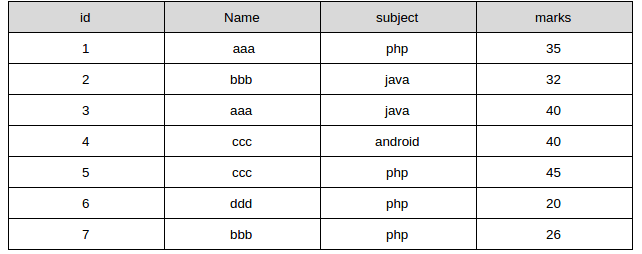
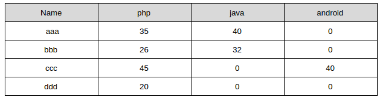

# frm,MYD,MYI

    frm是表的schema
    MYD是数据文件
    MYI是索引
    *.frm是描述了表的结构，*.MYD保存了表的数据记录，*.MYI则是表的索引
    直接放在mysql的data目录下就能在MySQL命令行看到表了
# 命令

    修改列名
    alter table tableName change column oldName newName varchar(255)
    
    修改表名
    alter table tableName rename to newName;
    
    查看执行计划
    explain select * from data;
    
    查看表的索引
    show idnex from tableName;
    
    查看编码等信息
    status
    
    新建表
    create table tt as 
    select @rownum:=@rownum+1 as id,
    username,
    password,
    email,
    cardno from new12306;
    
    只更新一条
    UPDATE t1 SET c=c+1 WHERE a=1 OR b=2 LIMIT 1;
    
    查看变量
    show variables like '%secure%';
    
    导出表数据
    select * from new12306 into outfile '12306.txt' 
    fields terminated by ',' enclosed by '"'
    lines terminated by '\r\n';
    默认位置为mysql当前库中的表数据文件路径
    
    /* 延迟30秒执行，防止锁释放 */
    SELECT SLEEP(30);
    
# mysql的事务
    默认是自动提交
    如果要手动提交的话需要 start transaction
    savepoint是一个保存点
    然后可以rollback to savepoint name
    InnoDB supports the SQL statements SAVEPOINT, ROLLBACK TO SAVEPOINT, 
    RELEASE SAVEPOINT and the optional WORK keyword for ROLLBACK.
    
    The SAVEPOINT statement sets a named transaction savepoint with a name of the identifier.
     If the current transaction has a savepoint with the same name, 
     the old savepoint is deleted and a new one is set.
    
    The ROLLBACK TO SAVEPOINT statement rolls back a transaction to the named savepoint 
    without terminating the transaction. 
    Modifications that the current transaction made to rows after the savepoint 
    was set are undone in the rollback, 
    but InnoDB does not release the row locks that were stored in memory after the savepoint.
    
    https://www.w3resource.com/mysql/mysql-transaction.php

​    设置事务隔离级别
​    SET [GLOBAL | SESSION] TRANSACTION
​        transaction_characteristic [, transaction_characteristic] ...
​    	
​    transaction_characteristic:      
​        ISOLATION LEVEL level    
​      | READ WRITE    
​      | READ ONLY    
​    
​    level:       
​      REPEATABLE READ     
​      | READ COMMITTED     
​      | READ UNCOMMITTED     
​      | SERIALIZABLE
​      
​    With the GLOBAL keyword, the statement applies globally for all subsequent sessions. Existing sessions are unaffected.
​    With the SESSION keyword, the statement applies to all subsequent transactions performed within the current session.
​    Without any SESSION or GLOBAL keyword, the statement applies to the next (not started) transaction performed within the current session.
​    加了GLOBAL,随后的所有session都是该级别,已经存在的不受影响
​    加了SESSION,当前的session之后的所有session都是该级别
​    啥都没加就是下一个事务是设置的隔离级别 

# 查看当前事务隔离级别

	select @@tx_isolation;
# 查看系统当前隔离级别
	select @@global.tx_isolation;
# 查看当前会话隔离级别
	select @@session.tx_isolation;
# 设置隔离级别
SET [SESSION|GLOBAL] TRANSACTION ISOLATION LEVEL [READ UNCOMMITTED|READ COMMITTED|REPEATABLE READ|SERIALIZABLE]

# mysql for loop

    ITERATE can appear only within LOOP, REPEAT, and WHILE statements. ITERATE means “start the loop again.”

    CREATE PROCEDURE insertData(p1 INT)
    BEGIN
        label1: LOOP
            SET p1 = p1 + 1;
            IF p1 < 10 THEN
                ITERATE label1;
            END IF;
            LEAVE label1;
        END LOOP label1;
        SET @x = p1;
    END;
# 启动mysql报系统无法找到文件
    打开Windows的服务
    windows+R
    services.msc
    找到mysql服务并且点击右键查看属性
    发现可执行文件的路径为"C:\Program Files\MySQL\MySQL Server 5.7\mysqld" MySQL
    打开注册表
    定位到该路径
    HKEY_LOCAL_MACHINE -> SYSTEM -> CurrentControlSet -? services -> mysql -> ImagePath
    修改该值为mysql的安装路径
# mysql执行计划
    https://dev.mysql.com/doc/refman/8.0/en/explain-output.html
    id		The SELECT identifier   
    select_type		The SELECT type		
    table		The table for the output row	
    partitions		The matching partitions		
    type	access_type	The join type		
    possible_keys	The possible indexes to choose	
    key		The index actually chosen	
    key_len		The length of the chosen key	
    ref		The columns compared to the index	
    rows		Estimate of rows to be examined
    filtered		Percentage of rows filtered by table condition
    Extra	None	Additional information
# mysql查看已定义的函数
    SHOW FUNCTION STATUS LIKE 'hello';
    SHOW  CREATE FUNCTION hello;
# mysql按照中文拼音排序
    order by (name using gbk) asc;
# 类似与oracle中nvl函数
	select IFNULL(0,10);
# mysql中的字符串查找函数
	select instr("abcdefg",'b');
# groupby分组连接函数
	group_concat(column order by column separator ',') 
# 日期增加函数
	date_add(now(),interval 1 second)
	date_add(now(),interval 1 minute)
	date_add(now(),interval 1 hour)
	date_add(now(),interval 1 day)
	date_add(now(),interval 1 week)
	date_add(now(),interval 1 month)
	date_add(now(),interval 1 quarter)
	date_add(now(),interval 1 year)
# 根据字段查询表名
	使用information_schema.COLUMNS表中的信息
# mysql日期格式
    格式  描述
    %a  缩写星期名
    %b  缩写月名
    %c  月，数值
    %D  带有英文前缀的月中的天
    %d  月的天，数值(00-31)
    %e  月的天，数值(0-31)
    %f  微秒
    %H  小时 (00-23)
    %h  小时 (01-12)
    %I  小时 (01-12)
    %i  分钟，数值(00-59)
    %j  年的天 (001-366)
    %k  小时 (0-23)
    %l  小时 (1-12)
    %M  月名
    %m  月，数值(00-12)
    %p  AM 或 PM
    %r  时间，12-小时（hh:mm:ss AM 或 PM）
    %S  秒(00-59)
    %s  秒(00-59)
    %T  时间, 24-小时 (hh:mm:ss)
    %U  周 (00-53) 星期日是一周的第一天
    %u  周 (00-53) 星期一是一周的第一天
    %V  周 (01-53) 星期日是一周的第一天，与 %X 使用
    %v  周 (01-53) 星期一是一周的第一天，与 %x 使用
    %W  星期名
    %w  周的天 （0=星期日, 6=星期六）
    %X  年，其中的星期日是周的第一天，4 位，与 %V 使用
    %x  年，其中的星期一是周的第一天，4 位，与 %v 使用
    %Y  年，4 位
    %y  年，2 位
# mysql中移除结尾的0
	select cast(1.234000 as char)+0        //1.234
>https://stackoverflow.com/questions/7968531/remove-trailing-zeros-in-decimal-value-with-changing-length

# sql不加orderby 按照什么排序?
	按照数据物理存储(不确定)
# 索引
## 新增索引
	alter table new12306 add INDEX index_username(username);
## 删除索引
	drop index index_username on new12306;
	新增组合索引
	ALTER TABLE `table` ADD INDEX name_city_age (name,city,age); 
	全文索引
	ALTER TABLE article ADD FULLTEXT index_content(content)
# mysql大数据量
## 插入技巧
	load data infile
	插入前移除索引,插入后重建索引
	insert into table (col1,col2) values (val1,val2),(val3,val4);
## 插入更新
	INSERT INTO t1 (a,b,c) VALUES (1,2,3) ON DUPLICATE KEY UPDATE c=c+1;
	REPLACE INTO test VALUES (1, 'New', '2014-08-20 18:47:42');
	https://dev.mysql.com/doc/refman/5.7/en/replace.html
	尝试插入数据,由于主键重复或者唯一索引而报错时，删除这条冲突的数据并且插入新的数据
	
	创建临时表，先更新临时表，然后从临时表中update
	create temporary table tmp(id int(4) primary key,dr varchar(50));
	insert into tmp values  (0,'gone'), (1,'xx'),...(m,'yy');
	update test_tbl, tmp set test_tbl.dr=tmp.dr where test_tbl.id=tmp.id;
​    
​	UPDATE categories 
​	SET dingdan = CASE id 
​	    WHEN 1 THEN 3 
​	    WHEN 2 THEN 4 
​	    WHEN 3 THEN 5 
​	END, 
​	title = CASE id 
​	    WHEN 1 THEN 'New Title 1'
​	    WHEN 2 THEN 'New Title 2'
​	    WHEN 3 THEN 'New Title 3'
​	END
​	WHERE id IN (1,2,3)

​	其他思路
​		配置mysql的日志，缓冲区，等信息

# mysql查询数据并返回给客户端
	获取一行，写到 net_buffer 中。这块内存的大小是由参数 net_buffer_length 定义的，默认是 16k。重复获取行，直到 net_buffer 写满，调用网络接口发出去。如果发送成功，就清空 net_buffer，然后继续取下一行，并写入 net_buffer。如果发送函数返回 EAGAIN 或 WSAEWOULDBLOCK，就表示本地网络栈（socket send buffer）写满了，进入等待。直到网络栈重新可写，再继续发送
	
	如果客户端A性能慢，迟迟不去读取socket receive buffer，server端就不能发送，此时如果客户端A要读取的数据被其他线程频繁update，由于mvcc的实现，这个变更会记录到undo log，大量的日志会不会使io飙升？可能比较极端才会吧。如果此时客户端性能恢复，服务端要读取最新数据，并通过undo log计算较早的版本，是不是要也占用大量的cpu资源或者io资源
# 拼音排序重庆变成了zhong庆排到了最后
order by convert(if(orgName='重庆分公司'),'冲庆分公司',orgName) using gbk)
# mysql行转列
## 原始数据

    select  name,
      sum(case when subject = 'php' then marks else 0 end) php,
      sum(case when subject = 'java' then marks else 0 end) java,
      sum(case when subject = 'android' then marks else 0 end) android
    from students
    group by name

##转换后的数据

