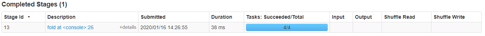

## 算子
## transform
* textFile
    ```
    def textFile(
        path: String,
        minPartitions: Int = defaultMinPartitions): RDD[String] = withScope {
    def defaultMinPartitions: Int = math.min(defaultParallelism, 2)
    ```
    没指定的话分区为默认并行度和2的最小值,通常是2  
    但第一个参数path也可以用目录,那么如果目录下又多个文件分区数如何算?  
    不指定分区参数的情况下  
    1. 一个605M两个7M的文件最后有了21个Task  
    605/32~=18.9=19  
    两个文件各一个Task  
    2. 单独两个7M的文件最后有了2个Task  
    也就是一个文件只要不达到spark的读取一个分区的最大数据那么就一个分区  
    如果达到了就将该文件划分为多个分区  
    如果指定了分区数为3  
    表现行为暂时未得出规律------源码在computeSize相关方法和HDFS计算splitSize中,InputFormat的getSplits  
* map(fun(e))
* mapPartitions(fun(Iterator[Int]):Iterator[Int])  
    参数是一个函数,该函数接收一个能遍历一个分区数据的迭代器并且返回一个分区  
    ```
    def function(iter:Iterator[Int]):Iterator[Int]={
    
    }
    ```
* mapPartitionsWithIndex(fun(Int,Iterator[Int]):Iterator[Int])  
    作用同mapPartitions,不同点在于传入的参数多了一个当前分区索引值  
    ```
    def function(index:Int,iter:Iterator[Int]):Iterator[Int]={
    
    }
    ```
* mapWith   
    mapWith(a=>a*10)((e,a)=>a+e)  
        第一个函数a是分区号  
        第二个函数的a是第一个函数的输出结果  
    ```
    def mapWith[A, U: ClassTag]
          (constructA: Int => A, preservesPartitioning: Boolean = false)
          (f: (T, A) => U): RDD[U] = withScope {
    }
    ```
* flatMapWith  
    原理同上,在执行flatMap算子需要分区信息的时候可以用  
    ``` 
    def flatMapWith[A, U: ClassTag]
      (constructA: Int => A, preservesPartitioning: Boolean = false)
      (f: (T, A) => Seq[U]): RDD[U] = withScope {
    }
    ```
* foreachWith 
    ```
    def foreachWith[A](constructA: Int => A)(f: (T, A) => Unit): Unit = withScope {    
    ``` 
* filterWith  
    ```
    def filterWith[A](constructA: Int => A)(p: (T, A) => Boolean): RDD[T] = withScope {
    ```
* mapValues		
    不发生shuffle  
    对value进行map操作不对key操作  
* filter(fun(e))  
    filter		过滤		rdd1.filter(_._2>2)  		rdd.filter(x => x._2==2)
* flatMap(fun(e):Array[Int])  
    参数是一个返回数组的函数  
    flatMap(e=>e.split(" "))  
* sample(withReplacement,fraction,seed)  
    不是action  
    数据抽样,去除一部分数据  
    sample(false,0.5,1)  
    withReplacement表示取样是取出来的数据是否放回  
    seed一直一样的话就一直是重复的数据
* union  
    不发生shuffle  
    数据不去重(sql中的union是去重的)  
    rdd.union(rdd1)  
    >Return the union of this RDD and another one. Any identical elements will appear multiple
    times (use `.distinct()` to eliminate them).                  
       
    另一种写法    
    rdd++rdd1  
* filterByRange(lower: K, upper: K): RDD[P]  
    作用于Map类型的RDD
    rdd.keyBy(e=>e).filterByRange(3,8).collect
* keyBy[K](f: T => K): RDD[(K, T)]  
    将一个单独的元素变成一个Map,相当于为一个List的所有左边元素加上一个Key
* zip  
    不发生shuffle
    两个相同元素的RDD组成一个Map,左边的是key,右边的是value
    每个分区的元素个数必须相同,元素总个数必须相同否则报错
* pipe(command: String): RDD[String]  
    就像运行一个Runtime.exec一样  
    command是一个脚本的路径  
    脚本的输入就是调用这个pipe方法的当前RDD  
    对于当前RDD的每一个分区调用一次外部程序  
    外部程序的标准输出就是该pipe方法的返回值RDD的一个分区  
    rdd每个个分区启动一个外部程序,stdin是外部程序的输入,新的RDD的输入是外部程序的输出  
    外部程序怎么引用这个数据源呢? 
    ``` 
    while read LINE; do
       echo ${LINE}!
    done
    ```

* treeReduce  
    使用 treeReduce & treeAggregate 替换 reduce & aggregate。
    数据量较大时，reduce & aggregate 一次性聚合，Shuffle 量太大，
    而 treeReduce & treeAggregate 是分批聚合，更为保险
* treeAggregate  
* flatMapValues(f)  
    对每一个value做一个flat Map函数
* lookup(key)  
* combineByKey  
* foldByKey  
* sampleByKey  
* partitionByKey(partitioner:Partitioner)  
    使用自定义的分区器重新分区一下
* countByKey  
* countByValueApprox  
* collectAsMap():Map[K,V]  
* aggregateByKey  
    def aggregateByKey[U: ClassTag](zeroValue: U, partitioner: Partitioner)(seqOp: (U, V) => U,
    combOp: (U, U) => U): RDD[(K, U)] = self.withScope {
    根据key进行聚合操作,使用方法类似下面的aggregate算子
* glom  
    将RDD的每一行合并为一个数组
## shuffle
### join
* join  
    ```
    def join[W](other: RDD[(K, W)], partitioner: Partitioner): RDD[(K, (V, W))] = self.withScope {
        this.cogroup(other, partitioner).flatMapValues( pair =>
          for (v <- pair._1.iterator; w <- pair._2.iterator) yield (v, w)
        )
    }
    ```
* leftOuterJoin  
    ```
    this.cogroup(other, partitioner).flatMapValues { pair =>
          if (pair._2.isEmpty) {
            pair._1.iterator.map(v => (v, None))
          } else {
            for (v <- pair._1.iterator; w <- pair._2.iterator) yield (v, Some(w))
          }
    }    
    ```
* rightOuterJoin  
    ```
    this.cogroup(other, partitioner).flatMapValues { pair =>
          if (pair._1.isEmpty) {
            pair._2.iterator.map(w => (None, w))
          } else {
            for (v <- pair._1.iterator; w <- pair._2.iterator) yield (Some(v), w)
          }
    }    
    ```
* fullOuterJoin  
    ```
    this.cogroup(other, partitioner).flatMapValues {
          case (vs, Seq()) => vs.iterator.map(v => (Some(v), None))
          case (Seq(), ws) => ws.iterator.map(w => (None, Some(w)))
          case (vs, ws) => for (v <- vs.iterator; w <- ws.iterator) yield (Some(v), Some(w))
    }
    ```
* subtract  
    Return an RDD with the elements from `this` that are not in `other`.
    返回在thisRDD中的但是不在otherRDD中的元素
    部分源码:
    this.map(x => (x, null)).subtractByKey(other.map((_, null)), p2).keys
    rdd1.subtract(rdd)
    rdd1中的元素减去rdd中的元素
    这个的DAG划分和intersection差不多,三个stage,最后一个stage依赖前两个stage
* subtractByKey  
    def subtractByKey[W: ClassTag](other: RDD[(K, W)], p: Partitioner): RDD[(K, V)] = self.withScope {
        new SubtractedRDD[K, V, W](self, other, p)
    }
    也是返回在这个RDD中的但是不在另一个RDD中的元素
    忽略value,只看key是否相等
* intersection  
    >Return the intersection of this RDD and another one. The output will not contain any duplicate
    elements, even if the input RDDs did.  
    
    两个rdd的交集并去重且无序返回
    ```
    this.map(v => (v, null)).cogroup(other.map(v => (v, null)))
            .filter { case (_, (leftGroup, rightGroup)) => leftGroup.nonEmpty && rightGroup.nonEmpty }
            .keys    
    ```
    感到有点奇怪,源码中intersection是由一系列其他算子组合的,然后在SparkUI上只有intersection算子
    而且  
        val rdd1=sc.parallelize(1 to 10)  
        val rdd2=sc.parallelize(10 to 15)  
        rdd1.intersection(rdd2).collect  
        在spark UI上有三个Stage  
    猜测:  
    spark UI上估计只是显示用户的代码  
    DAGScheduler只知道这个方法中发生了Shuffle,也就是shuffle发生在intersection内部的算子中  
    但是在spark UI上显示的是intersection方法,这个spark UI上显示的应该是源码中的CallSite这个  
    类的相关信息,这个类代表的是用户的代码位置,既然是我们的代码那么肯定就是只能看到intersection     
    第一个stage是rdd2执行parallelize和intersection中的map算子    
    第二个stage是rdd1执行parallelize和intersection中的map算子    
    然后在第三个stage中执行intersection中的cogroup算子,该算子需要前两个stage的数据    
    这样也就说得通了,cogroup是个宽依赖,最后cogroup一直到最后的keys再到collect的触发action    
    刚好三个stage
### 重分区
* coalesce(numPartitions:Int,shuffle:Boolean)  
    重新分区,比如你现在有100个分区，然后指定numPartitions为10那么新生成的分区会有以前10个分区的数据，这个时候并没有发生shuffle,  
    如果你进行一个剧烈的coalesce,比如numPartitions=1,那么可能算子都会运行在一个节点上    
    你也可以指定shuffle=true,这回增加一个shuffle过程    
    比如当前分区是100,指定numPartitions是1000,shuffle=true    
    当100个分区中有几个分区的数据特别大的时候这非常有用    
    指定1000个分区并且发生shuffle,那么会以哈希分区器将数据分布在不同分区中  
* repartition  
    ```
    def repartition(numPartitions: Int)(implicit ord: Ordering[T] = null): RDD[T] = withScope {
        coalesce(numPartitions, shuffle = true)
    }
    ```
* repartitionAndSortWithinPartitions  
    根据partitioner进行分区并在每个分区中按照key进行排序
### ByKey聚合
* reduceByKey对所有相同的key做归约操作  
    对相同key的value做归约操作,最后的结果是(k,v) 
    ```
    res4: Array[(Int, Int)] = Array((1,1), (2,1), (3,1), (4,1), (5,1), (6,1), (7,1), (8,1), (92,1), (3,1), (4,1), (5,1), (6,1), (7,1))
    reduceByKey((e1,e2)=>e1+e2,3).collect
    res9: Array[(Int, Int)] = Array((6,2), (3,2), (4,2), (1,1), (7,2), (92,1), (8,1), (5,2), (2,1))   
    ```
* groupByKey    
    对相同的key进行分组,最后的结果是(k,(v1,v2,v3...vn))
    When called on a dataset of (K, V) pairs, returns a dataset of (K, Iterable<V>) pairs
    res4: Array[(Int, Int)] = Array((1,1), (2,1), (3,1), (4,1), (5,1), (6,1), (7,1), (8,1), (92,1), (3,1), (4,1), (5,1), (6,1), (7,1))
    groupByKey(3).collect 
    res7: Array[(Int, Iterable[Int])] = Array((6,CompactBuffer(1, 1)), (3,CompactBuffer(1, 1)), (4,CompactBuffer(1, 1)), (1,CompactBuffer(1)), (7,Compa
    ctBuffer(1, 1)),(92,CompactBuffer(1)), (8,CompactBuffer(1)), (5,CompactBuffer(1, 1)), (2,CompactBuffer(1)))
    将数据分组,numTasks作用同上
* groupBy(Function)  
    按照给定的函数进行分组
    groupBy(_%2)按照模2的值进行分组,所以只有两组,一组的值为0,另一个为1
    示例:
    val rdd=sc.parallelize(1 to 10)
    rdd.groupBy(_%2).collect
    res18: Array[(Int, Iterable[Int])] = Array((0,CompactBuffer(2, 4, 6, 8, 10)), (1,CompactBuffer(1, 3, 5, 7, 9)))
    rdd.groupBy(_%3).collect
    res19: Array[(Int, Iterable[Int])] = Array((0,CompactBuffer(3, 6, 9)), (1,CompactBuffer(1, 4, 7, 10)), (2,CompactBuffer(2, 5, 8)))
* cogroup(RDD)		  
        两个数据共同的分组
		先把两个数据集的所有key去重得到不同的值
		在每一个不同的值后面加上第一个数据集中和他相同的值
		在第二个数据及中加上和他相同的值		
        (1,2)(2,3)(3,4)
        (2,4)(3,6)(4,8)
        (1,((2),())),(2,((3),(4))),(3,((4),(6))),(4,((),(8)))     
### sort排序
>这两个算子会触发action,因为使用了RangePartitioner,该分区器内部会首先使用collect抽取一部分样本统计分区的边界
>所以调用了这两个算子会立马在Spark UI上看到一个action触发
* sortBy  
    ```
    def sortBy[K](
          f: (T) => K,
          ascending: Boolean = true,
          numPartitions: Int = this.partitions.length)
          (implicit ord: Ordering[K], ctag: ClassTag[K]): RDD[T] = withScope {
        this.keyBy[K](f)
            .sortByKey(ascending, numPartitions)
            .values
      }
    ```
    给一个元素加上一个key然后通过sortByKey排序然后取values  
    生成key的函数的参数是RDD中的每一个元素  
* sortByKey  
    ```
    def sortByKey(ascending: Boolean = true, numPartitions: Int = self.partitions.length)
          : RDD[(K, V)] = self.withScope
      {
        val part = new RangePartitioner(numPartitions, self, ascending)
        new ShuffledRDD[K, V, V](self, part)
          .setKeyOrdering(if (ascending) ordering else ordering.reverse)
      }
    ```      
    >Sort the RDD by key, so that each partition contains a sorted range of the elements. Calling
    `collect` or `save` on the resulting RDD will return or output an ordered list of records
    (in the `save` case, they will be written to multiple `part-X` files in the filesystem, in
    order of the keys).
    
    根据key进行排序,每个分区行都包含一个有序的元素范围   
    调用collect或者save会返回或者输出记录的有序列表   
    调用save方法时,有序的元素会根据key的排序被写入多个part-x文件中  
    
    >sortBy is implemented using sortByKey 
    which depends on a RangePartitioner (JVM) or partitioning function (Python). 
    When you call sortBy / sortByKey partitioner (partitioning function) is initialized 
    eagerly and samples input RDD to compute partition boundaries. 
    Job you see corresponds to this process.
    Actual sorting is performed only if you execute an action on the newly created RDD 
    or its descendants.
    
### 去重
* distinct(numPartitions)  
    ```
    def distinct(numPartitions: Int)(implicit ord: Ordering[T] = null): RDD[T] = withScope {
        map(x => (x, null)).reduceByKey((x, y) => x, numPartitions).map(_._1)
    }
    ```
    去重	(k,v),去重时相同的key不同的value是不同的数据,只有key和value都相同才去掉  
    ```
    scala> val rdd=sc.parallelize(1 to 100,5)
    rdd: org.apache.spark.rdd.RDD[Int] = ParallelCollectionRDD[0] at parallelize at <console>:24  
    scala> rdd.distinct(10).collect
    res0: Array[Int] = Array(100, 80, 30, 50, 40, 90, 70, 20, 60, 10, 41, 61, 81, 21, 71, 11, 51, 1, 91, 31, 52, 82, 22, 32, 92, 62, 42, 72, 12, 2, 13,
     53, 73, 93, 33, 23, 63, 83, 3, 43, 84, 34, 4, 54, 14, 24, 64, 74, 44, 94, 15, 55, 25, 95, 65, 35, 75, 45, 85, 5, 96, 56, 76, 16, 66, 46, 36, 6, 86
    , 26, 47, 77, 97, 27, 57, 37, 17, 67, 7, 87, 28, 48, 98, 8, 18, 38, 58, 88, 78, 68, 19, 39, 29, 79, 59, 89, 69, 9, 49, 99)
    ```
    两个stage  
    stage0 distinct task 5  这个是读取数据的任务数  
    stage1 collect  task 10 这个是distinct后的任务数  
    distinct(10),这个10可以认为生成的分区数,将去重后的数据分成了10个分区  
    去重前从1-100中  
    第一个任务选择被10整除的数据x%10=0  
    然后第二个任务选择除以10余1的数据x%10=1  
    以此类推     
    上面的结果其实也就是reduceByKey进行分区了      
## action
* foreach(fun(e))  
    遍历  
* foreachPartition(fun(iter(Iterator)))  
    对每个分区遍历,参数是个分区所有元素的迭代器  
* toLocalIterator  
* reduce  
    归约操作  
    reduce((x,y)=>{})  
    x代表返回值,y表示每一个元素,x的初始值是0  
* aggregate  
    reduce只能返回和x相同的值且x没有初始值  
    fold可以设置初始值但返回类型还是固定的  
    aggregate可以设置初始值并且返回不同的类型  
    aggregate对每个分区的数据进行归约,然后将每个分区的结果拿来,再次进行归约,两次归约的初始值都是设定的
    核心代码:  
    ```
    def aggregate[U: ClassTag](zeroValue: U)(seqOp: (U, T) => U, combOp: (U, U) => U): U = withScope 
    val aggregatePartition = (it: Iterator[T]) => it.aggregate(zeroValue)(cleanSeqOp, cleanCombOp)
    val mergeResult = (index: Int, taskResult: U) => jobResult = combOp(jobResult, taskResult)
    sc.runJob(this, aggregatePartition, mergeResult)
    ```
    示例:  
    ```
    val rdd=sc.parallelize(1 to 10)
    val t=rdd.aggregate((0,0))((x,y)=>(x._1+y,x._2+1),(x,y)=>(x._1+y._1,x._2+y._2))
    res6: (Int, Int) = (55,10)
    t._1/t._2.toFloat
    res8: Float = 5.5
    ```
    解释:  
        上面的jo
        b提交了4个Task来执行  
        假如各个Task所执行的分区数据是(1,2),(3,4),(5,6,7),(8,9,10)  
        每个Task都执行seqOp函数  
        SeqOp函数中x的类型是(m1,m2),且我们指定了其初始值(0,0)  
        y表示的是RDD的每一个数据  
        对RDD的每一个数据调用一次seqOp函数,将结果作为下一次调用的x的参数  
        所以第一个分区的第一次函数调用是((0,0),1)=>(0+1,0+1)=(1,1)  
        然后将第一次函数调用的结果作为第二次函数调用的x的参数  
        第二次函数调用是:((1,1),2)=>(1+2,1+1)=(3,2)  
        其他分区的依次类推,最后每个分区的结果分别是  
        (3,2),(7,2),(18,3),(27,3)  
        可以看出第一个数代表分区内的元素总和,第二个数代表分区内元素个数  
        最后对各个分区的结果执行comOp函数  
        comOp函数的第一个参数是我们指定的初始值,第二个参数是上一步得到的每一个结果  
        第一次调用:((0,0),(3,2))=>(0+3,0+2)=(3,2)  
        第一次调用:((3,2),(7,2))=>(3+7,2+2)=(10,4)  
        第二次调用:((10,4),(18,3))=>(10+18,4+3)=(28,7)  
        第三次调用:((28,7),(27,3))=>(28+27,7+3)=(55,10)  
        最后的结果就是一个元组(55,10)  
        最后我们可以直接将两数相除得到1到10的平均值  
        
        所以如果我们指定了初始值为(100,0)那么上述代码最终的结果就是(555,10)  
        100加了五次,每个Task在SeqOp函数中执行了一次  
        最后在Driver端的comOp函数中执行了一次   
* collect  
    将数据汇集到driver节点上来,结果是一个数组
* collectPartitions  
    将数据汇集到driver节点上来,为每一个分区产生一个数组,结果是要给二维数组
* count():Long  
    每个分区的结果相加
* toArray()  
    def toArray(): Array[T] = withScope {
        collect()
    }
* countApprox(timeout)  
    def countApprox(
          timeout: Long,
          confidence: Double = 0.95): PartialResult[BoundedDouble] = withScope 
    在一个timeout内尽可能返回值,即使不完成也无所谓
* countByValue  
    def countByValue()(implicit ord: Ordering[T] = null): Map[T, Long] = withScope {
        map(value => (value, null)).countByKey()
    }
* countByKey  
    def countByKey(): Map[K, Long] = self.withScope {
        self.mapValues(_ => 1L).reduceByKey(_ + _).collect().toMap
    }
    有一部分复杂的算子都是通过一些基础的算出组合得来的
* top(num:Int)  
    top,取前几个元素(最大值,ascii码排序)
* max  
    按照ascii码比较
* min  
    按照ascii码比较
* first()  
    第一个元素
* collect(fun)  
    收集符合函数的结果
* fold  
    ```
    def fold(zeroValue: T)(op: (T, T) => T): T = withScope {      
    ```
    类似于reduce,与reduce不同的是可以指定返回值x的初始值  
    ```
    val rdd=sc.parallelize(1 to 10)  
    rdd.fold(10)((x,y)=>x+y)=105      
    ```
    在spark-shell中执行上面的代码是105,不是应该是10+1+...+10=65吗?  
    在spark-UI中发现执行上面的代码有四个task  
      
    假如是(1,2),(3,4),(5,6,7),(8,9,10)  
    那么每个分区计算后的结果是(1+2+10=13),(3+4+10=17),(5+6+7+10=28),(8+9+10+10=37)  
    最后在fold源码中还有这样一行代码  
    ```
    val mergeResult = (index: Int, taskResult: T) => jobResult = op(jobResult, taskResult)      
    ```
    在driver端对所有worker端的结果再次执行一次fold函数  
    那么最终结果就是(13+17+28+37+10=105)  
* takeSample(withReplacement,num,seed)  
    该方法需要将所有的数据都拉到driver端  
    主要代码是  
    sample+collect,通过sample取样然后通过collect拉到driver端  
* take(num:Int)  
    拉去n个元素  
* takeOrdered(n,[ordering])  
    返回前几行数据并且排序  
* saveAsTextFile(path)    
    ```
     val rdd=sc.parallelize(1 to 100,5)  
     rdd.saveAsTextFile("D:/data/3")   
    ```
    生成的文件  
    2020/01/11  23:13                12 .part-00000.crc  
    2020/01/11  23:13                12 .part-00001.crc  
    2020/01/11  23:13                12 .part-00002.crc  
    2020/01/11  23:13                12 .part-00003.crc  
    2020/01/11  23:13                12 .part-00004.crc  
    2020/01/11  23:13                 8 ._SUCCESS.crc  
    2020/01/11  23:13                51 part-00000  
    2020/01/11  23:13                60 part-00001  
    2020/01/11  23:13                60 part-00002  
    2020/01/11  23:13                60 part-00003  
    2020/01/11  23:13                61 part-00004  
* saveAsSequenceFile(path)    
* saveAsObjectFile(path)  
