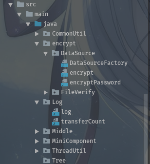

    
# Eclipse
    Ctrl+Shift+x    大写
    Ctrl+Shift+y    小写
# Idea
    Ctrl+Alt+L格式化代码
    Ctrl+Alt+O优化import(将*替换为对应的类)
	Ctrl+Shift+上下键	上移当前行   
    Ctrl+Shift+U  大小写转换
    Ctrl+上  向上滚动一行
    Ctrl+下  向下滚动一行
    Ctrl+[   跳转到代码块的开头 
    Ctrl+]   跳转到代码块的开始
    Ctrl+G   跳转到指定行
    Ctrl+N   查找类文件
    Ctrl+D	复制当前行
    Alt+B    返回上次光标位置
    Alt+W    从鼠标当前位置向外扩展选中

# idea中的WebApplication Exploded和web Application Archive
    第一个以文件夹的形式发布
    第二个以war的形式发布
# idea中的tomcat中的资源更新
	on update action   手动触发!
	如下图,红色下方的刷新按钮,点击的时候会弹出对话框(tomcat界面show dialog默认选中)

	on framework deactivation	框架失去焦点(也就是从idea切换到了其他应用)
# idea中部署的tomcat项目
	catabase目录在~/.Ideaxxxx/system/tomcat
	存放jsp和css、js文件的目录是artifact打包的目录
# idea自动生成注释
IDEA默认的   /** Enter
	
自定义的

* Editor--Live Templates
* Template text设置为
	```
	*
	* @Description: $description$
	* $params$
	* @return $return$
	* @Author: fcy
	* @Date: $date$
	*/
	```
* Abbreviation设置为n (这个是自定义的)
* Description设置为方法注释
* Expand with选择为Tab
* 勾选Reformat according to style
* 勾选Shorten FQ names 
* 点击Edit Variables

| Names | 	Expresion | Default value | Skip if defined|
| -- | -- | -- | -- |
| description | | | + |
| params | | | + |
| return | methodReturnType() | | + |
| date | date() | | + |

* 其中params的Expression填写为(groovy脚本)
`
groovyScript("     def result='';     def params=\"${_1}\".replaceAll('[\\\\[|\\\\]|\\\\s]', '').split(',').toList();     for(i = 0; i < params.size(); i++) {         if(i!=0)result+= ' * ';         result+='@param ' + params[i] + ': ' + ((i < (params.size() - 1)) ? '\\n' + '\\t' : '');     };     return result", methodParameters())
`


* Expression代表生成注释的值
* Skip if defined :如果勾选了,生成注释后光标不会再该变量上,如果没勾选你的话生成注释后光标会在该变量上
* 上面所有设置好了后光标停在某个方法上   按键/   按键n  按键Tab   ,注释就自动生成了
# idea省电模式
	File-->Power Save Mode
	class文件的图标会变


