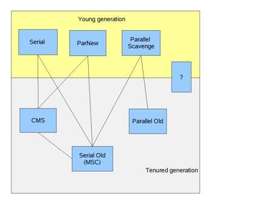

# 表格

#### 写法
```
    | Tables        | Are           | Cool  |
    | ------------- |:-------------:| -----:|
    | col 3 is      | right-aligned | $1600 |
    | col 2 is      | centered      |   $12 |
    | zebra stripes | are neat      |    $1 |
```
### 显示
| Tables        | Are           | Cool  |
| ------------- |:-------------:| -----:|
| col 3 is      | right-aligned | $1600 |
| col 2 is      | centered      |   $12 |
| zebra stripes | are neat      |    $1 |
# 图片
### 写法  
```


```
### 显示


# 链接
### 写法  
```[谷歌](http://www.google.com)```  
### 显示  
[谷歌](http://www.google.com)

# 引用
### 写法  
```
>这是一段引用文字
>>这又是引用呢
>>>这还是引用呢。。。
```
### 显示  
>这是一段引用文字
>>这又是引用呢
>>
>>>这还是引用呢。。。
# 列表
### 写法
```
+ 列表1
+ 列表2
- 列表3
- 列表4
1. 有序列表1
2. 有序列表2
3. 有序列表3
```
### 显示  
+ 列表1
+ 列表2
- 列表3
- 列表4
1. 有序列表1
2. 有序列表2
3. 有序列表3
# 粗体和斜体
### 写法
```
* **两个\*号包含一端文本就是粗体**
* __两个\_包起来的也是粗体__
* ~~删除线~~
```
### 显示
* **两个\*号包含一端文本就是粗体**
* __两个\_包起来的也是粗体__
* ~~两个\~包起来的就是删除~~
# 分割线
### 写法
```
    ---
    ***
```
### 显示
---
***
# 代码
`
    create database fcy(id string);
`

### 多行代码
```
    function test(){
    
    }
```
# 选中
```
	- [x] 第一项
	- [ ] 第二项
	- [ ] 第三项
```
## 显示
- [x] 第一项
- [ ] 第二项
- [ ] 第三项
