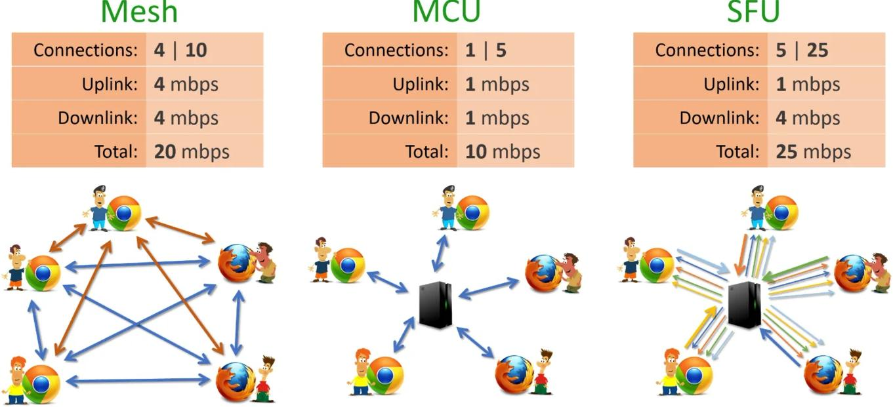

rtmp 是一个协议，传输流媒体数据的协议，应用层协议
hls也是一个协议，苹果公司的，通过http传输流媒体数据，分片传输,常见的m3u8就是他的索引文件

直播推流：把视频数据推送到服务器上，推送协议有rtmp，客户端需要有支持rtmp协议的客户端，服务器需要有支持rtmp协议的服务端，obs推流，nginx搭建rtmp服务器
直播播放：将服务器存储的视频信息拉到客户端，可以通过hls协议，rtmp协议拉取视频数据

# webrtc
ice server: webrtc使用一个名为ICE的框架来进行打洞，它内部整合了STUN和TRUN
stun server: 帮助双方发现对方的公网ip
turn server: 在无法获取公网IP的时候通过服务器转发流媒体数据

WebRTC 它主要使用一個名為ICE ( Interactive Connectivity Establishment ) 的框架來進行打洞，它內部整合了 STUN 與 TURN 協議
sdp: 会话描述协议，描述多媒体链接内容的协议，分辨率，支持的编码格式等等，确切的说这是一种数据格式
nat: 网络地址转换。有多重类型，锥形，对称型等等

## webrtc通信模式

### Mesh架构
优点是逻辑简单，容易使下
缺点是没新增一个客户端，所有客户端都要增加一条通道，人越多，浏览器端压力越大，效果越差，另外没有服务器端，无法对视频做额外处理
需要的连接: (5-1)?=1+2+3+4
### MCU架构
服务器端负责视频编码解码等工作，连接少，浏览器端的压力小，5个连接
适合多人视频会议
### SFU架构
看起来和MCU一样，但SFU服务器只负责转发，不做编码解码等工作，但需要下载其他参与方的视频信息，5*5个连接
典型场景是1对N的视频互动
### 开源方案
+ Jitsi ```https://github.com/jitsi/jitsi```
+ Kurento ```https://github.com/Kurento/kurento-media-server```
+ Licode ```https://github.com/lynckia/licode```
+ Janus ```https://github.com/meetecho/janus-gateway```
+ Mediasoup ```https://github.com/versatica/mediasoup```
# 四种nat类型
依次为nat1,nat2,nat3,nat4
## Full Cone NAT(允许任意IP+任意端口)
内网主机建立一个UDP socket(LocalIP:LocalPort) 第一次使用这个socket给外部主机发送数据时NAT会给其分配一个公网(PublicIP:PublicPort),以后用这个socket向外面任何主机发送数据都将使用这对(PublicIP:PublicPort)。**此外，任何外部主机只要知道这个(PublicIP:PublicPort)就可以发送数据给(PublicIP:PublicPort)，内网的主机就能收到这个数据包**
## Restricted Cone NAT(ip受限)
内网主机建立一个UDP socket(LocalIP:LocalPort) 第一次使用这个socket给外部主机发送数据时NAT会给其分配一个公网(PublicIP:PublicPort),以后用这个socket向外面任何主机发送数据都将使用这对(PublicIP:PublicPort)。**此外，如果任何外部主机想要发送数据给这个内网主机，只要知道这个(PublicIP:PublicPort)并且内网主机之前用这个socket曾向这个外部主机IP发送过数据。只要满足这两个条件，这个外部主机就可以用自己的(IP,任何端口)发送数据给(PublicIP:PublicPort)，内网的主机就能收到这个数据包** 
## Port Restricted Cone NAT(ip+port受限)
内网主机建立一个UDP socket(LocalIP:LocalPort) 第一次使用这个socket给外部主机发送数据时NAT会给其分配一个公网(PublicIP:PublicPort),以后用这个socket向外面任何主机发送数据都将使用这对(PublicIP:PublicPort)。**此外，如果任何外部主机想要发送数据给这个内网主机，只要知道这个(PublicIP:PublicPort)并且内网主机之前用这个socket曾向这个外部主机(IP,Port)发送过数据。只要满足这两个条件，这个外部主机就可以用自己的(IP,Port)发送数据给(PublicIP:PublicPort)，内网的主机就能收到这个数据包**
## Symmetric NAT
内网主机建立一个UDP socket(LocalIP,LocalPort),当用这个socket第一次发数据给外部主机1时,NAT为其映射一个(PublicIP-1,Port-1),以后内网主机发送给外部主机1的所有数据都是用这个(PublicIP-1,Port-1)，如果内网主机同时用这个socket给外部主机2发送数据，第一次发送时，NAT会为其分配一个(PublicIP-2,Port-2), 以后内网主机发送给外部主机2的所有数据都是用这个(PublicIP-2,Port-2).如果NAT有多于一个公网IP，则PublicIP-1和PublicIP-2可能不同，如果NAT只有一个公网IP,则Port-1和Port-2肯定不同，也就是说一定不能是PublicIP-1等于 PublicIP-2且Port-1等于Port-2。**此外，如果任何外部主机想要发送数据给这个内网主机，那么它首先应该收到内网主机发给他的数据，然后才能往回发送，否则即使他知道内网主机的一个(PublicIP,Port)也不能发送数据给内网主机，这种NAT无法实现UDP-P2P通信。**

# nat类型检测
这个没啥技巧，根据四种nat类型的特点不断和服务器发包检测，逐步判断是哪一种nat类型

# nat穿透
## 关键在于复用nat的映射关系
1.PC1(192.168.1.1:7777) 发送 UDP 请求到 Server(9.9.9.9:1024)，此时 Server 可以获取到 PC1 的出口地址端口(也就是 Router1 的出口地址端口) 1.2.3.4:10000，同时 Router1 添加一条映射 192.168.1.1:7777 <=> 1.2.3.4:10000 <=> 9.9.9.9:1024

2.PC2(192.168.2.1:8888) 同样发送 UDP 请求到 Server，Router2 添加一条映射 192.168.2.1:8888 <=> 5.6.7.8:20000 <=> 9.9.9.9:1024

3.Server 将 PC2 的出口地址端口(5.6.7.8:20000) 发送给 PC1

4.Server 将 PC1 的出口地址端口(1.2.3.4:10000) 发送给 PC2

5.PC1 使用相同的内网地址端口(192.168.1.1:7777)发送 UDP 请求到 PC2 的出口地址端口(Router2 5.6.7.8:20000)，此时 Router1 添加一条映射 192.168.1.1:7777 <=> 1.2.3.4:10000 <=> 5.6.7.8:20000，与此同时 Router2 没有关于 1.2.3.4:10000 的映射，这个请求将被 Router2 丢弃

6.PC2 使用相同的内网地址端口(192.168.2.1:8888)发送 UDP 请求到 PC1 的出口地址端口(Router1 1.2.3.4:10000)，此时 Router2 添加一条映射 192.168.2.1:8888 <=> 5.6.7.8:20000 <=> 1.2.3.4:10000，与此同时 Router1 有一条关于 5.6.7.8:20000 的映射(上一步中添加的)，Router1 将报文转发给 PC1(192.168.1.1:7777)

7.在 Router1 和 Router2 都有了对方的映射关系，此时 PC1 和 PC2 通过 UDP 穿透建立通信。


# blob和ArrayBuffer数据类型

